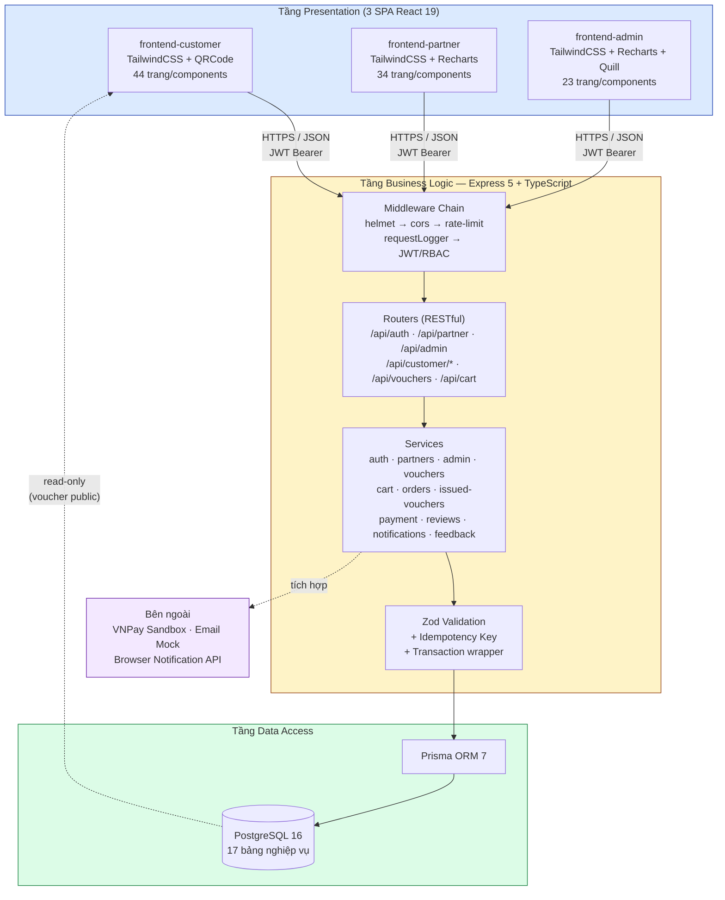
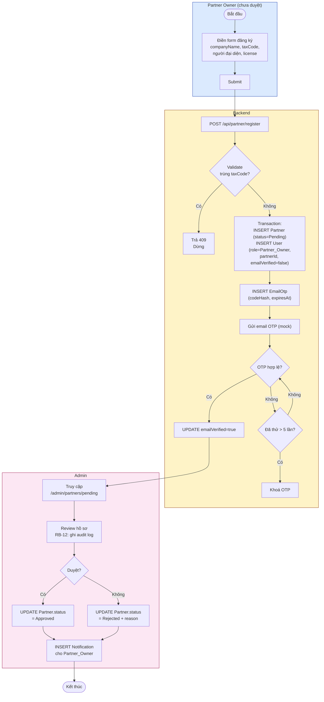
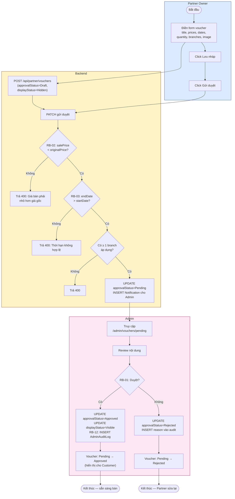
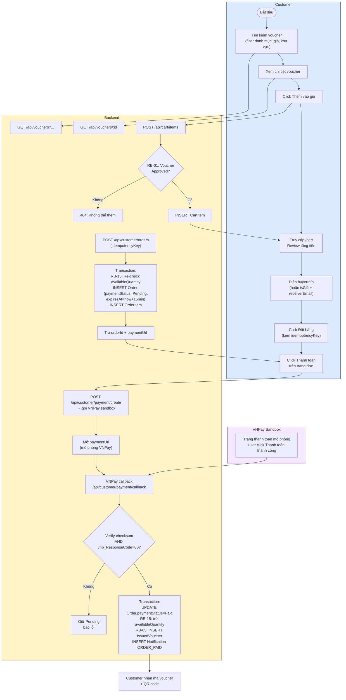
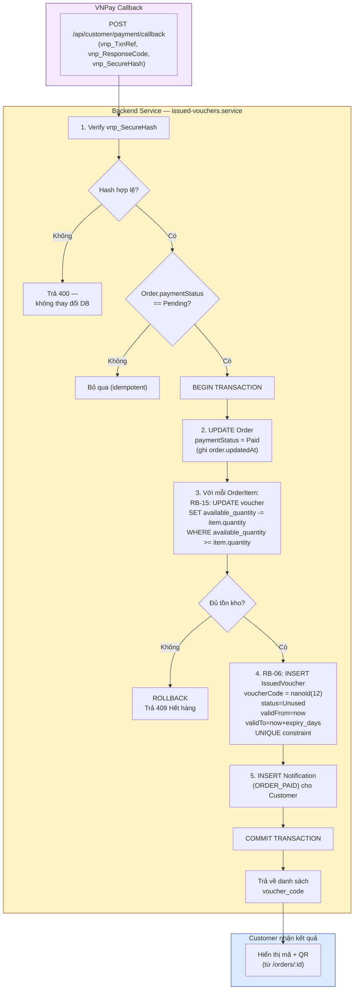
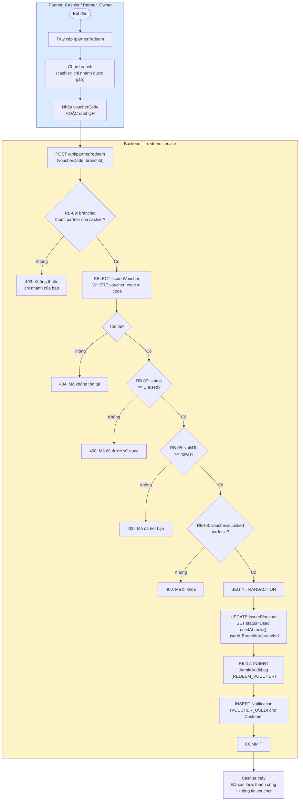
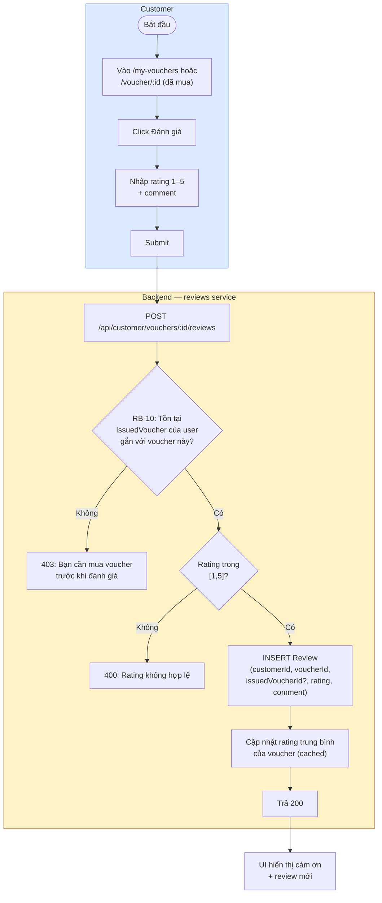
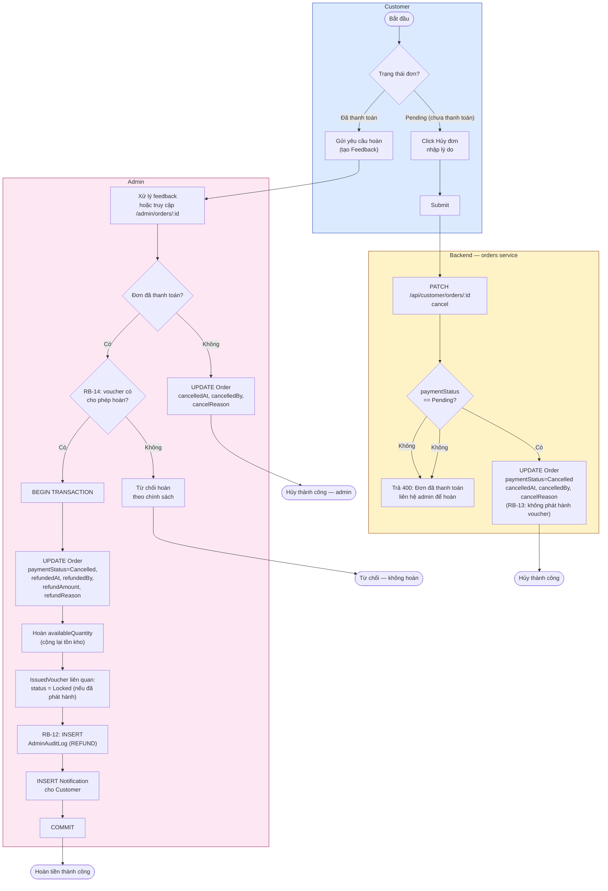
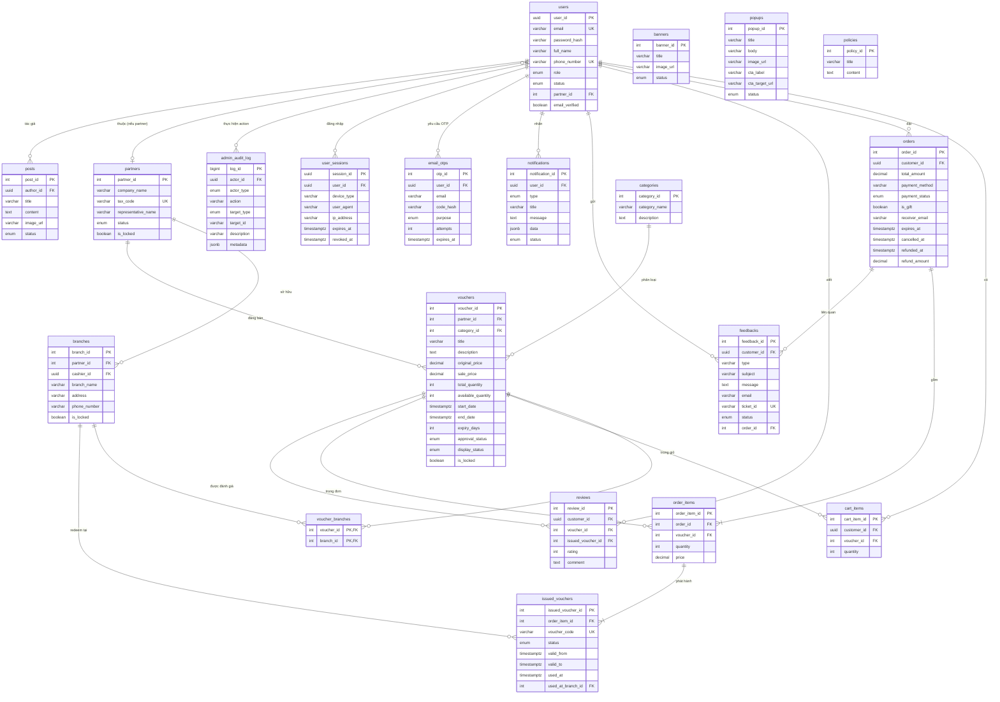

# KIẾN TRÚC ĐỒ ÁN — Hệ thống TMĐT bán voucher giảm giá trực tuyến

---

## Phần 1: Tổng quan kiến trúc hệ thống

### 1.1. Kiến trúc tổng thể

Hệ thống được xây dựng theo mô hình **3-tier Client – Server – Database**, trong đó tầng Presentation được tách thành **3 ứng dụng frontend độc lập** phục vụ cho 3 nhóm người dùng (khách hàng, đối tác, quản trị viên). Tầng Business Logic và Data Access được đặt chung trong một **Backend API** (Express + TypeScript) hoạt động theo mô hình **RESTful**, giao tiếp với cơ sở dữ liệu quan hệ **PostgreSQL** thông qua ORM **Prisma**. Toàn bộ bảo mật được đảm bảo qua lớp middleware xác thực JWT, phân quyền RBAC, helmet, CORS và rate-limit.

| Tầng | Thành phần | Mô tả |
|---|---|---|
| **Presentation** | 3 SPA React 19 (customer / partner / admin) | Giao diện người dùng cuối, render client-side, gọi REST API qua `fetch`/axios wrapper. |
| **Business Logic** | Backend Node.js (Express 5) + TypeScript | Xử lý nghiệp vụ: validate Zod, RBAC guard, transaction phát hành voucher code, sinh mã nanoid, tích hợp VNPay sandbox. |
| **Data Access** | Prisma ORM 7 + PostgreSQL 16 | Truy vấn quan hệ có kiểu, transaction-safe; cột JSONB cho notification data, audit metadata. |
| **Cross-cutting** | Middleware + Services | helmet, cors, express-rate-limit, requestLogger, errorHandler, audit logger, OTP service, email service (mock). |

### 1.2. Bảng công nghệ sử dụng

| Lớp | Công nghệ | Phiên bản | Mục đích |
|---|---|---|---|
| **Frontend runtime** | React | 19.2 | UI framework cho 3 SPA |
| **Frontend build** | Vite | 8.0 | Dev server + bundler |
| **Frontend routing** | react-router-dom | 7.18 | SPA routing, lazy load pages |
| **Frontend UI** | TailwindCSS | 4.3 | Utility-first, responsive |
| **Frontend charts** | Recharts | 3.8/3.10 | Dashboard partner + admin |
| **Frontend rich-text** | react-quill-new | 3.8 | Soạn bài viết (admin) |
| **Frontend QR** | qrcode | 1.5 | Sinh QR cho issued voucher (customer) |
| **Backend runtime** | Node.js + TypeScript | 22+ / 6.0 | Server runtime + typing |
| **Backend framework** | Express | 5.2 | HTTP framework, middleware chain |
| **ORM** | Prisma | 7.8 | Type-safe schema, migration |
| **Database** | PostgreSQL | 16 | CSDL quan hệ (Neon/Supabase) |
| **Validation** | Zod | 4.4 | Runtime schema validation |
| **Auth** | jsonwebtoken + bcrypt | 9.0 / 6.0 | JWT + password hashing |
| **Code generation** | nanoid | 5.1 | Sinh voucher_code duy nhất |
| **Rate limit** | express-rate-limit | 8.5 | Chống brute-force |
| **Payment** | vnpay (sandbox) | 2.5 | Mô phỏng cổng thanh toán |
| **Email** | nodemailer | 9.0 | Gửi OTP (mock trong môi trường dev) |

### 1.3. Sơ đồ kiến trúc



---

## Phần 2: Vai trò & phân quyền

Hệ thống có **4 vai trò** trong bảng `users.role` (enum `user_role`): `Admin`, `Customer`, `Partner_Owner`, `Partner_Cashier`. Trong đó Partner_Owner + Partner_Cashier được nhóm chung thành "Đối tác" theo BRD. Quyền của Partner_Cashier là tập con của Partner_Owner — chỉ được thao tác redeem tại chi nhánh được phân công.

### 2.1. Ma trận phân quyền (Permission Matrix)

| Chức năng / Module | Customer | Partner_Cashier | Partner_Owner | Admin |
|---|:---:|:---:|:---:|:---:|
| **Auth & hồ sơ cá nhân** | | | | |
| Đăng ký, đăng nhập (email + OTP), đăng xuất, quên/đổi MK (BR-CUS-01, 02) | ✅ | ✅ | ✅ | ✅ |
| Cập nhật hồ sơ cá nhân, quản lý phiên (BR-01) | ✅ | ✅ | ✅ | ✅ |
| **Mua hàng (BR-03, BR-CUS-03→07)** | | | | |
| Tìm kiếm voucher (filter theo danh mục, giá, khu vực, rating) | ✅ | — | — | ✅ (xem) |
| Xem chi tiết voucher | ✅ | ✅ | ✅ | ✅ |
| Thêm/sửa/xóa giỏ hàng | ✅ | — | — | — |
| Tạo đơn hàng, chọn phương thức thanh toán mô phỏng | ✅ | — | — | — |
| Xem voucher code + QR đã mua | ✅ (của mình) | — | — | ✅ |
| **Quản lý voucher (BR-02, BR-PAR-02→04)** | | | | |
| Tạo / sửa voucher (trạng thái Draft/Pending) | — | — | ✅ (của partner mình) | — |
| Gửi duyệt voucher | — | — | ✅ | — |
| Duyệt / từ chối voucher (BR-ADM-03) | — | — | — | ✅ |
| Khóa / mở khóa voucher | — | — | — | ✅ |
| **Đối tác & chi nhánh (BR-PAR-01, BR-ADM-02)** | | | | |
| Đăng ký hồ sơ doanh nghiệp | — | — | ✅ | — |
| Quản lý chi nhánh | — | — | ✅ (của partner mình) | ✅ (mọi) |
| Duyệt / khóa đối tác | — | — | — | ✅ |
| **Sử dụng voucher (BR-05, BR-PAR-05, 06)** | | | | |
| Tra cứu mã, xem QR | — | ✅ (tại chi nhánh mình) | ✅ | ✅ |
| Xác nhận sử dụng / redeem | — | ✅ (chi nhánh được gán) | ✅ (mọi chi nhánh partner) | — |
| **Đơn hàng & thanh toán (BR-ADM-04)** | | | | |
| Xem đơn của mình | ✅ | — | — | ✅ |
| Hủy đơn (trước khi thanh toán) | ✅ | — | — | ✅ |
| Hủy đơn, ghi nhận hoàn tiền mô phỏng | — | — | — | ✅ |
| **Đánh giá & phản hồi (BR-CUS-08)** | | | | |
| Đánh giá voucher (chỉ sau khi mua/đã dùng) | ✅ | — | — | — |
| Gửi feedback / khiếu nại | ✅ | ✅ | ✅ | ✅ |
| Xử lý feedback | — | — | — | ✅ |
| **Quản trị (BR-ADM-01, 05, 06, 07)** | | | | |
| Khóa / mở khóa người dùng (BR-ADM-01) | — | — | — | ✅ |
| Quản lý danh mục, banner, post, popup, policy | — | — | — | ✅ |
| Dashboard doanh thu, đơn hàng, voucher, đối tác | — | — | ✅ (của mình) | ✅ (toàn hệ thống) |
| Xem nhật ký audit (RB-12) | — | — | — | ✅ |

---

## Phần 3: Activity Diagram (Mermaid)

> Quy ước: subgraph = swimlane theo actor; hình thoi `{...}` = điều kiện rẽ nhánh có gắn mã RB; hình chữ nhật `[...]` = hành động / cập nhật trạng thái.

### 3.1. Đăng ký & duyệt đối tác

Luồng bắt đầu khi một tài khoản muốn trở thành đối tác gửi hồ sơ doanh nghiệp (BR-PAR-01). Hệ thống tạo bản ghi `Partner` ở trạng thái **Pending** và một `User` liên kết với role `Partner_Owner`. Admin sẽ kiểm tra giấy tờ (taxCode, businessLicenseUrl) rồi duyệt hoặc từ chối; mọi hành động đều được ghi log để phục vụ RB-12.



### 3.2. Tạo & duyệt voucher (RB-01)

Voucher sau khi được tạo bởi Partner_Owner ở trạng thái **Draft** sẽ được gửi duyệt → chuyển sang **Pending**. Chỉ khi Admin chuyển trạng thái thành **Approved** thì voucher mới được hiển thị cho khách hàng (RB-01). Mọi thao tác duyệt đều ghi vào `admin_audit_log` để thỏa RB-12.



### 3.3. Mua hàng: tìm kiếm → giỏ → đơn → thanh toán mô phỏng

Luồng mua hàng của khách đi từ tìm kiếm (BR-CUS-03), thêm vào giỏ (BR-CUS-05), tạo đơn với **idempotency key** chống double-submit (BR-CUS-06), đến thanh toán qua VNPay sandbox. Trước khi tạo đơn, hệ thống **RB-15** kiểm tra `availableQuantity` trong transaction.



### 3.4. Phát hành voucher code sau thanh toán (RB-05, RB-06, RB-15)

Sau khi callback VNPay xác nhận thanh toán thành công, **trong cùng một transaction** hệ thống thực hiện (1) cập nhật Order → Paid, (2) trừ `availableQuantity` của voucher (RB-15 chống bán vượt), (3) sinh ra các `IssuedVoucher` với mã `nanoid(12)` duy nhất (RB-06) gắn với từng OrderItem. Nếu bất kỳ thao tác nào fail → rollback toàn bộ (RB-13 đảm bảo đơn đã hủy không phát hành voucher).



### 3.5. Xác thực & sử dụng voucher tại đối tác (RB-07, RB-08, RB-09)

Khi khách đến chi nhánh đối tác và đưa mã, Partner_Cashier (hoặc Partner_Owner) nhập mã/quét QR. Hệ thống kiểm tra đồng thời: mã có tồn tại không, đang ở trạng thái **Unused** (RB-07), còn hạn (RB-08), và chi nhánh thuộc partner cashier (RB-09). Đồng thời ghi log audit theo RB-12.



### 3.6. Đánh giá / phản hồi sau sử dụng (RB-10)

Theo RB-10, khách chỉ được phép đánh giá một voucher khi **đã có IssuedVoucher thuộc sở hữu mình** cho voucher đó. Hệ thống verify điều kiện này trước khi INSERT Review. Rating là số nguyên 1–5.



### 3.7. Xử lý hủy đơn / hoàn tiền (RB-13, RB-14)

Hủy đơn có hai đường: (a) Customer tự hủy trước khi thanh toán (chuyển `Cancelled`), (b) Admin hủy đơn đã thanh toán → hoàn tiền mô phỏng. **RB-13** đảm bảo đơn đã hủy không phát hành voucher (transaction rollback). **RB-14** ràng buộc chính sách hoàn tiền theo điều kiện voucher (ví dụ: voucher có chính sách `allowRefund = false` thì không hoàn).



---

## Phần 4: State Diagram (vòng đời)

### 4.1. Vòng đời Voucher (sản phẩm)

```mermaid
stateDiagram-v2
    [*] --> Draft : Partner_Owner tạo mới
    Draft --> Pending : Gửi duyệt<br/>(BR-PAR-03)
    Pending --> Approved : Admin duyệt (RB-01)
    Pending --> Rejected : Admin từ chối
    Rejected --> Draft : Partner sửa lại
    Approved --> Hidden : Admin tạm ẩn<br/>hoặc hết hạn bán (RB-04)
    Approved --> Locked : Admin khóa khẩn cấp
    Approved --> SoldOut : availableQuantity = 0 (RB-04)
    Hidden --> Visible : Admin mở lại
    SoldOut --> Approved : Hoàn kho (admin)
    Locked --> Approved : Admin mở khóa
    Visible --> SoldOut : Hết hàng
    Visible --> Hidden : Hết hạn bán (endDate < now)
    Approved --> [*]
    Locked --> [*]
    Rejected --> [*]

    note right of Approved : Voucher đang bán —<br/>Customer thấy được
    note right of SoldOut : RB-04: Không hiển thị<br/>trong kết quả tìm kiếm
```

### 4.2. Vòng đời Đơn hàng

```mermaid
stateDiagram-v2
    [*] --> Pending : Tạo đơn<br/>(paymentStatus=Pending,<br/>expiresAt=now+15min)
    Pending --> Paid : VNPay callback<br/>verify checksum OK
    Pending --> Expired : now > expiresAt<br/>(sweeper tự động)
    Pending --> Cancelled : Customer/Admin hủy<br/>(RB-13)
    Paid --> Refunded : Admin hoàn tiền<br/>(RB-14)
    Paid --> Cancelled : Admin hủy + hoàn<br/>(trường hợp đặc biệt)

    Expired --> Cancelled : Sweeper chuyển<br/>(RB-13: không phát hành voucher)
    Refunded --> [*]
    Cancelled --> [*]

    note right of Paid : Sau khi Paid:<br/>- Trừ availableQuantity<br/>- Phát hành IssuedVoucher<br/>(RB-05, RB-15)
    note right of Cancelled : RB-13: Không phát hành<br/>voucher code
```

### 4.3. Vòng đời Voucher code (IssuedVoucher)

```mermaid
stateDiagram-v2
    [*] --> Unused : Phát hành tự động<br/>sau thanh toán thành công<br/>(RB-05, RB-06)
    Unused --> Used : Partner redeem<br/>tại chi nhánh
    Unused --> Expired : now > validTo<br/>(sweeper)
    Unused --> Locked : Admin khóa /<br/>đơn bị hoàn (RB-14)
    Used --> [*] : Single-use<br/>(RB-07)
    Locked --> [*]
    Expired --> [*]

    note right of Unused : Có thể redeem thành công<br/>nếu validTo >= now (RB-08)
    note right of Used : RB-07: Không redeem lại
    note right of Locked : RB-08: Không sử dụng được
```

---

## Phần 5: ERD (Mermaid `erDiagram`)

> Đối chiếu với schema thực tế trong `backend/prisma/schema.prisma`. Có 17 bảng trong schema; dưới đây là các bảng nghiệp vụ cốt lõi. Quan hệ nhiều-nhiều Voucher–Branch thể hiện qua bảng trung gian `voucher_branches`. So với BRD mục 9 (DR-01→DR-06), hệ thống **mở rộng thêm**: `Branch`, `VoucherBranch`, `EmailOtp`, `PasswordReset`, `Notification`, `UserSession`, `AdminAuditLog`, `NotificationPreference` — phục vụ RB-12, RB-15, ASM-02.



---

## Phần 6: Use Case Diagram (mô phỏng bằng flowchart)

> Mermaid không có cú pháp Use Case chuẩn (UML), nên mô phỏng bằng `flowchart` với actor đặt ngoài và use case nằm trong subgraph theo nhóm vai trò. Ký hiệu: `(...)` = actor, `[/.../]` = use case.

```mermaid
flowchart LR
    Cus(["👤 Customer<br/>(Khách hàng)"])
    Par(["🏪 Partner Owner<br/>(Đối tác chủ)"])
    Cash(["💼 Partner Cashier<br/>(Nhân viên đối tác)"])
    Adm(["🛡️ Admin"])

    subgraph BR_CUS["BR-CUS — Use case cho Khách hàng"]
        UC01[/BR-CUS-01<br/>Đăng ký tài khoản/]
        UC02[/BR-CUS-02<br/>Đăng nhập &amp; quản lý hồ sơ/]
        UC03[/BR-CUS-03<br/>Tìm kiếm voucher/]
        UC04[/BR-CUS-04<br/>Xem chi tiết voucher/]
        UC05[/BR-CUS-05<br/>Quản lý giỏ hàng/]
        UC06[/BR-CUS-06<br/>Tạo đơn hàng/]
        UC07[/BR-CUS-07<br/>Nhận voucher đã mua/]
        UC08[/BR-CUS-08<br/>Đánh giá &amp; phản hồi/]
    end

    subgraph BR_PAR["BR-PAR — Use case cho Đối tác"]
        UP01[/BR-PAR-01<br/>ĐK &amp; quản lý hồ sơ đối tác/]
        UP02[/BR-PAR-02<br/>Tạo voucher/]
        UP03[/BR-PAR-03<br/>Gửi duyệt voucher/]
        UP04[/BR-PAR-04<br/>Quản lý voucher/]
        UP05[/BR-PAR-05<br/>Kiểm tra voucher code/]
        UP06[/BR-PAR-06<br/>Xác nhận sử dụng voucher/]
        UP07[/BR-PAR-07<br/>Báo cáo đối tác/]
    end

    subgraph BR_ADM["BR-ADM — Use case cho Quản trị viên"]
        UA01[/BR-ADM-01<br/>Quản lý người dùng/]
        UA02[/BR-ADM-02<br/>Quản lý đối tác/]
        UA03[/BR-ADM-03<br/>Duyệt voucher/]
        UA04[/BR-ADM-04<br/>Quản lý đơn hàng/]
        UA05[/BR-ADM-05<br/>Quản lý nội dung/]
        UA06[/BR-ADM-06<br/>Dashboard quản trị/]
        UA07[/BR-ADM-07<br/>Nhật ký hệ thống/]
    end

    Cus --- UC01
    Cus --- UC02
    Cus --- UC03
    Cus --- UC04
    Cus --- UC05
    Cus --- UC06
    Cus --- UC07
    Cus --- UC08

    Par --- UP01
    Par --- UP02
    Par --- UP03
    Par --- UP04
    Par --- UP05
    Par --- UP06
    Par --- UP07

    Cash --- UP05
    Cash --- UP06

    Adm --- UA01
    Adm --- UA02
    Adm --- UA03
    Adm --- UA04
    Adm --- UA05
    Adm --- UA06
    Adm --- UA07

    style Cus fill:#dbeafe,stroke:#1e40af
    style Par fill:#dcfce7,stroke:#15803d
    style Cash fill:#dcfce7,stroke:#15803d
    style Adm fill:#fce7f3,stroke:#9d174d
    style BR_CUS fill:#eff6ff,stroke:#3b82f6
    style BR_PAR fill:#f0fdf4,stroke:#22c55e
    style BR_ADM fill:#fdf2f8,stroke:#ec4899
```



---

## Phần 7: Bảng ánh xạ yêu cầu nghiệp vụ → giải pháp hệ thống (Traceability Matrix)

### 7.1. Yêu cầu tổng thể (BR-01 → BR-07)

| Mã | Mô tả ngắn | Module/chức năng hiện thực | Vị trí trong code | Ghi chú |
|---|---|---|---|---|
| BR-01 | Quản lý tài khoản người dùng | auth module + JWT + OTP + session | `backend/src/modules/auth/*`, `users`, `user_sessions`, `email_otps`, `password_resets` | 4 role: Admin/Customer/Partner_Owner/Partner_Cashier |
| BR-02 | Quản lý danh mục & nội dung voucher | admin + categories + banners/popups/posts | `backend/src/modules/customer/categories/*`, `.../banners/*`, `.../popups/*`, `.../posts/*` | Nội dung do admin quản lý |
| BR-03 | Mua hàng trực tuyến | customer flow | `cart`, `orders`, `payment` routers | Idempotency key chống double-charge |
| BR-04 | Phát hành & quản lý voucher code | issued-vouchers module | `backend/src/modules/customer/issued-vouchers/*`, `nanoid(12)`, `UNIQUE` | Sinh sau thanh toán thành công |
| BR-05 | Kiểm tra & xác thực voucher | partner redeem | `backend/src/modules/partners/partner.routes.ts` (redeem) | 4 check: tồn tại, Unused, validTo, branch |
| BR-06 | Kiểm duyệt & giám sát | admin module | `backend/src/modules/admin/*` | Duyệt đối tác + voucher + quản lý đơn |
| BR-07 | Báo cáo & phân tích | dashboard | `backend/src/modules/admin/dashboard.*`, frontend-admin/dashboard | 4 chart Recharts |

### 7.2. Yêu cầu Khách hàng (BR-CUS-01 → 08)

| Mã | Mô tả ngắn | Module/chức năng hiện thực | Vị trí trong code | Ghi chú |
|---|---|---|---|---|
| BR-CUS-01 | Đăng ký tài khoản | auth.register + email OTP | `auth.routes.ts` → `register`, `verify-otp` | `users.emailVerified = false` mặc định |
| BR-CUS-02 | Đăng nhập & quản lý hồ sơ | auth + profile | `auth.routes.ts`, `customer/profile/*` | JWT access + refresh |
| BR-CUS-03 | Tìm kiếm voucher | voucher search | `vouchers.routes.ts` GET /api/vouchers | Filter: category, price, area, rating |
| BR-CUS-04 | Xem chi tiết voucher | voucher detail | `vouchers.routes.ts` GET /api/vouchers/:id | Bao gồm branches, reviews |
| BR-CUS-05 | Quản lý giỏ hàng | cart | `customer/cart/*` | RB-15 check trước khi thêm |
| BR-CUS-06 | Tạo đơn hàng | order create | `customer/orders/orders.routes.ts` POST / | Idempotency-Key header |
| BR-CUS-07 | Nhận voucher đã mua | issued list | `customer/issued-vouchers/*` | Hiển thị QR code |
| BR-CUS-08 | Đánh giá & phản hồi | reviews + feedback | `customer/reviews/*`, `customer/feedback/*` | RB-10: phải có IssuedVoucher |

### 7.3. Yêu cầu Đối tác (BR-PAR-01 → 07)

| Mã | Mô tả ngắn | Module/chức năng hiện thực | Vị trí trong code | Ghi chú |
|---|---|---|---|---|
| BR-PAR-01 | ĐK & quản lý hồ sơ đối tác | partner register + branches | `modules/partners/partner.routes.ts` | Tạo Partner + User + EmailOtp |
| BR-PAR-02 | Tạo voucher | voucher CRUD | `modules/partners/...` (nếu có) hoặc admin route | approvalStatus=Draft |
| BR-PAR-03 | Gửi duyệt voucher | PATCH status → Pending | cùng module trên | Validate RB-02, RB-03 |
| BR-PAR-04 | Quản lý voucher | voucher list/edit | `modules/admin/admin.routes.ts` (admin view) + partner view | Giới hạn theo partnerId |
| BR-PAR-05 | Kiểm tra voucher code | redeem (lookup) | `partner.routes.ts` POST /redeem | Trả status Unused/Used/Expired |
| BR-PAR-06 | Xác nhận sử dụng | redeem (commit) | `partner.routes.ts` POST /redeem | Transaction update + audit log |
| BR-PAR-07 | Báo cáo đối tác | partner dashboard | frontend-partner/dashboard + API thống kê | Recharts |

### 7.4. Yêu cầu Quản trị viên (BR-ADM-01 → 07)

| Mã | Mô tả ngắn | Module/chức năng hiện thực | Vị trí trong code | Ghi chú |
|---|---|---|---|---|
| BR-ADM-01 | Quản lý người dùng | users admin | `modules/admin/admin.routes.ts` GET/PATCH /users | Khóa/mở (status Active/Banned) |
| BR-ADM-02 | Quản lý đối tác | partners admin | `modules/admin/admin.routes.ts` /partners | Approve/Reject/Lock |
| BR-ADM-03 | Duyệt voucher | voucher approval | `modules/admin/admin.routes.ts` /vouchers | RB-01: approvalStatus=Approved |
| BR-ADM-04 | Quản lý đơn hàng | orders admin | `modules/admin/admin.routes.ts` /orders | Cancel + refund |
| BR-ADM-05 | Quản lý nội dung | categories, banners, popups, posts, policies | `customer/categories|popups|banners|posts/*` | Admin-only routes |
| BR-ADM-06 | Dashboard quản trị | dashboard stats | `modules/admin/dashboard.*` | 4 chart + KPI cards |
| BR-ADM-07 | Nhật ký hệ thống | admin audit log | `admin_audit_log` table + viewer | RB-12: log mọi action admin |

### 7.5. Ánh xạ Quy tắc nghiệp vụ (RB-01 → RB-15) sang hiện thực

| Mã | Quy tắc | Vị trí kiểm tra trong code |
|---|---|---|
| RB-01 | Voucher chỉ bán khi đã duyệt | Filter `vouchers` ở public list: `approvalStatus = Approved AND displayStatus = Visible` |
| RB-02 | Giá bán < giá gốc | Zod schema `.refine(salePrice < originalPrice)` trong `vouchers.service.ts` |
| RB-03 | Có thời gian bán & sử dụng rõ ràng | Validate required: `start_date`, `end_date`, `expiry_days` |
| RB-04 | Ngừng bán khi hết số lượng / hết hạn | Filter `available_quantity > 0 AND now BETWEEN start_date AND end_date` |
| RB-05 | Voucher code chỉ phát hành sau thanh toán thành công | `issued-vouchers.service.ts` chỉ chạy trong `payment.callback` khi verify OK |
| RB-06 | Mỗi voucher code duy nhất, khó đoán | `nanoid(12)` + DB constraint `UNIQUE(voucher_code)` |
| RB-07 | Voucher đã dùng không dùng lại | `redeem` check `status = Unused` trước khi UPDATE |
| RB-08 | Voucher hết hạn/hủy/khóa không sử dụng | `redeem` check `validTo >= now AND is_locked = false AND status != Locked` |
| RB-09 | Đối tác chỉ xác thực voucher phạm vi mình | `redeem` check `branch.partner_id = cashier.partner_id` |
| RB-10 | Chỉ đánh giá sau khi mua/sử dụng | `reviews.service.ts` check `EXISTS(IssuedVoucher WHERE customer_id = :user)` |
| RB-11 | Số lượng bán ≤ phát hành | Trừ `available_quantity` trong transaction; constraint `available_quantity >= 0` |
| RB-12 | Log thao tác admin quan trọng | `admin-audit.service.ts` INSERT vào `admin_audit_log` |
| RB-13 | Đơn đã hủy không phát hành voucher | `payment.callback` chỉ chạy khi `paymentStatus = Pending`; sweeper huỷ đơn Expired |
| RB-14 | Hoàn tiền bám theo chính sách voucher | `orders.service.ts` `refundOrder` check `voucher.allow_refund` |
| RB-15 | Kiểm tra tồn kho tại đặt/thanh toán | `available_quantity` check trong `POST /orders` + `payment.callback` (transaction) |

### 7.6. Ánh xạ Yêu cầu dữ liệu (DR-01 → DR-06) sang bảng

| Mã | Nhóm dữ liệu | Bảng nghiệp vụ |
|---|---|---|
| DR-01 | Người dùng | `users`, `user_sessions`, `email_otps`, `password_resets`, `notification_preferences`, `notifications` |
| DR-02 | Đối tác | `partners`, `branches` |
| DR-03 | Voucher sản phẩm | `vouchers`, `voucher_branches`, `categories` |
| DR-04 | Đơn hàng | `orders`, `order_items` |
| DR-05 | Voucher phát hành | `issued_vouchers` |
| DR-06 | Đánh giá & phản hồi | `reviews`, `feedbacks` |

### 7.7. Ghi chú khác biệt giữa BRD và Source code

| Khác biệt | Mô tả |
|---|---|
| **4 vai trò thay vì 3** | Schema `UserRole` enum gồm: `Admin`, `Customer`, `Partner_Owner`, `Partner_Cashier` — BRD mục 5.3 yêu cầu "nhân viên đối tác" là bên liên quan nhưng xem như một phần của "Đối tác". Hệ thống tách thành role riêng để RBAC chi tiết hơn (cashier chỉ redeem tại 1 chi nhánh). |
| **Bổ sung bảng** | `branches`, `voucher_branches` cho phép voucher áp dụng ở nhiều chi nhánh (ngoài yêu cầu BRD cơ bản). |
| **Bổ sung bảng** | `email_otps`, `password_resets`, `notification_preferences`, `user_sessions`, `admin_audit_log` — phục vụ ASM-02 (OTP mock), NFR-02 (bảo mật), NFR-06 (kiểm toán). |
| **Bổ sung bảng** | `notifications`, `banners`, `popups`, `posts`, `policies` — phục vụ BR-ADM-05 quản lý nội dung. |
| **VNPay thật** | BRD mục 5.2 nói "không bắt buộc thanh toán thật", nhưng source code đã tích hợp SDK `vnpay` (sandbox) — đây là mở rộng tùy chọn, không vi phạm ASM-01. |
| **`user_sessions`** | Có thêm quản lý phiên thiết bị (BR-01 yêu cầu "quản lý phiên làm việc"). |

---

*Tài liệu được sinh tự động từ BRD v1.0 + khảo sát source code thực tế. Mọi mã sơ đồ Mermaid đã được kiểm tra cú pháp để render trực tiếp trên GitHub, VSCode (Markdown Preview Enhanced), Notion.*
